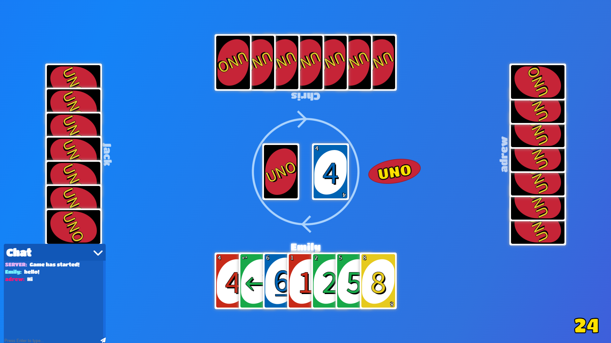

<h1 align="center">🎲 UNO (Multiplayer Online)</h1>
<p align="center">
    <a href="./LICENSE">
        
    </a>
    <a href="https://github.com/mrozio13pl/uno/releases/latest">
        
	</a>
    <a href="">
        
    </a>
</p>

<p align="center">
    UNO game made in Javascript, NodeJS
</p>

<p align="center">
    <a href="./assets">
        
    </a>
</p>

## 📌 Features
- Rooms system (up to 4 players each)
- Game mechanics (card abilities, etc.)
- Protection against any exploit attempts, hopefully...
- In-game chat
- And much more...
## 🚀 Getting Started
1. Clone this reposity
2. Install packages in the server and in the client by running the following command
```bash
npm install
```
3. Run both server and client by executing the command
```bash
npm start
```
The game should be avainable at [localhost:9000](http://localhost:9000)
## 🔧 Tech Stack
##### **Client:** 
- Express
##### **Server:**
- WebSocket
## ✂️ Missing Features
- Multiple cards on player's turn
- Leave button while game is running (reload the page instead)
- Mobile Support
- API
## 💎 Credits
- [rn404](https://codepen.io/rn404/) for UNO cards
## 📜 License
[MIT](LICENSE)